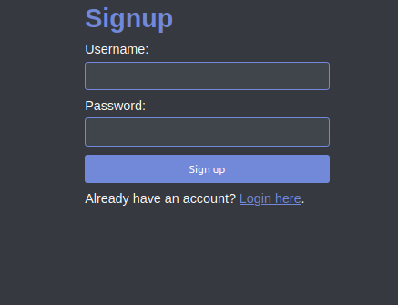

# purpose
I was tired of using gpt to generate starter apps with some basic styling that I liked, so I am posting this project to github to serve as a minimal template. There is only 3 endpoints: home, login, and signup. browse to /login to sign in, /signup to register, and successful login redirects the user to the home page at /. Error message are displayed when login or register fail or succeed.

# setup

install your python interpreter  
install the flask library: pip3 install -r requirements.txt  
run the app: python3 app.py  

# pics
